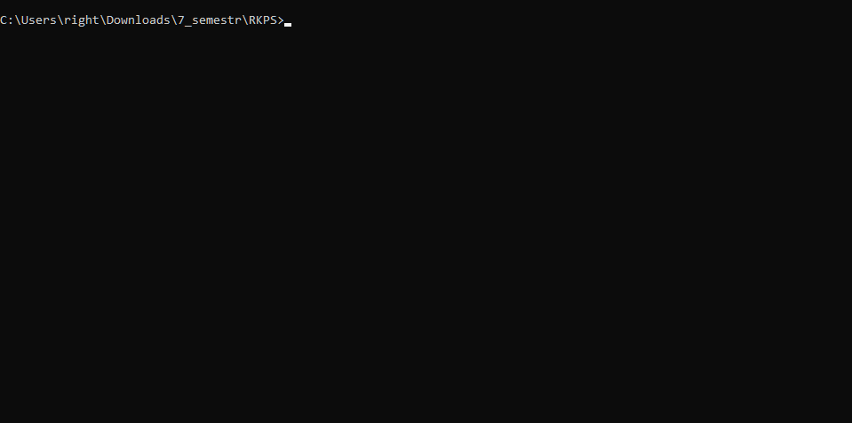
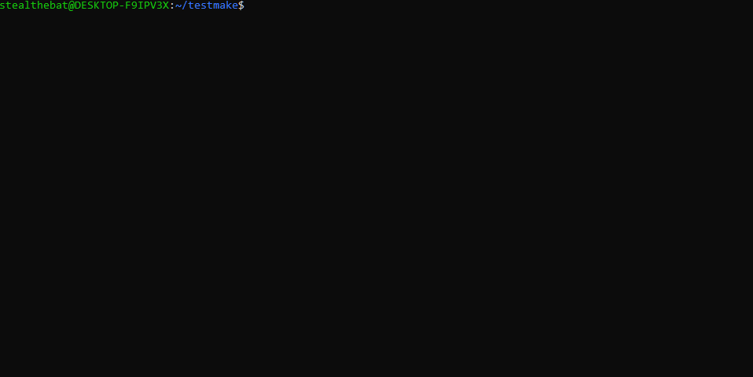

# Описание проекта

Проект представляет собой порт игры Magic Square, написанной на языке BASIC, на язык C. Исходный код взят из сборника [More BASIC Computer Games](https://www.roug.org/retrocomputing/languages/basic/morebasicgames).

# Запуск игры

С помощью утилиты `make`, игру можно запустить в Windows, Linux и веб-браузере. Для запуска необходима установленная утилита `make`.

## Windows

Команда:
```bash
make windows
```


## Linux

Команда: 
```bash
make linux
```


## Web

Команда:
```bash
make web
```


## Тестирование

Для проверки работы программы было реализовано автоматическое тестирование, симулирующее пользовательский ввод.

